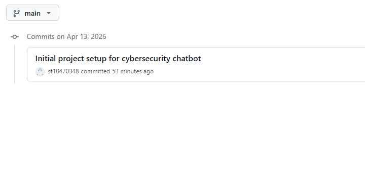

Cybersecurity Awareness Assistant

A C# console chatbot that teaches users basic cybersecurity awareness through a friendly, interactive conversation.

 ## Features
- Voice greeting on startup using a WAV file
- ASCII art splash screen
- Personalised greeting using the user's name
- Cybersecurity responses for:
  - phishing
  - password safety
  - suspicious links
  - malware
  - safe browsing
  - privacy
  - social engineering
- Input validation for empty or unsupported entries
- Coloured console interface with section dividers
- Structured code split across multiple classes
- GitHub Actions workflow for CI

## Project Structure
```text
CybersecurityAwarenessBot/
├── Assets/
│   ├── ascii_art.txt
│   └── welcome.wav
├── .github/
│   └── workflows/
│       └── dotnet.yml
├── AudioPlayer.cs
├── Chatbot.cs
├── ConsoleUI.cs
├── KnowledgeBase.cs
├── Program.cs
├── CybersecurityAwarenessBot.csproj
└── README.md
```

## How to Run
1. Open the project in Visual Studio or VS Code with the C# extension.
2. Restore NuGet packages.
3. Build the solution.
4. Run the console application.
5. Type your name and start asking cybersecurity questions.

## Presentation Video

[Watch the unlisted YouTube demo](https://youtube.com/shorts/ugDbBqRDTRk?si=wqaw29hJG21uEWhJ)

## GitHub Commit History




